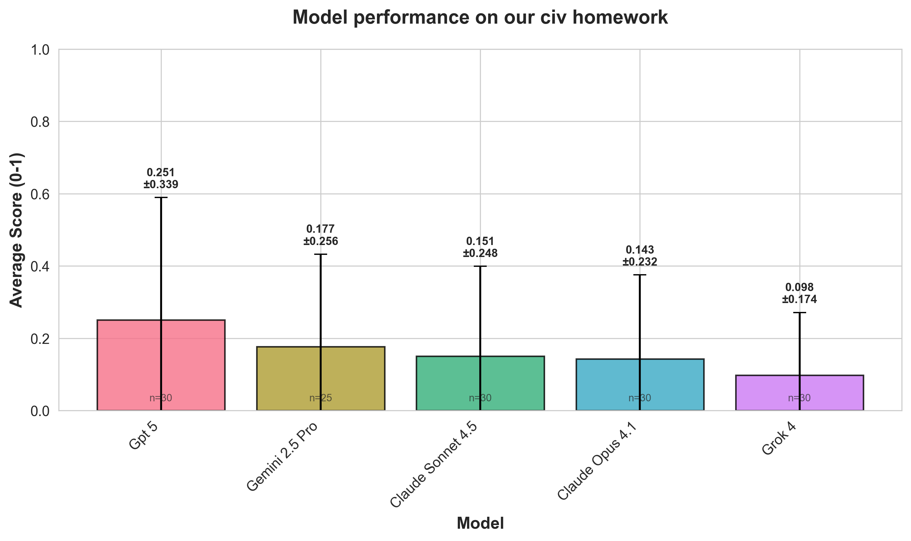

# Civbench

### Measuring the performance of frontier AI models on completing our civ homework. 

Note: If you poke around the repo and notice anything that seems off / like it might be messing with the results, please let me know! discord: inverted_badger_

I was talking someone, and he mentioned that for all his day-to-day AI needs he goes to Gemini, not ChatGPT - because he has to save those sweet sweet free GPT5 responses to do his CIV homework. 

That got me wondering: which models are actually the best at doing the civ? To test this I wrote a simpe benchmark. The benchmark gives each model an image of the homework question, and then checks its answers against Alan's answers, which I take to be ground truth.

github here https://github.com/Julian-Moncarz/civ_bench